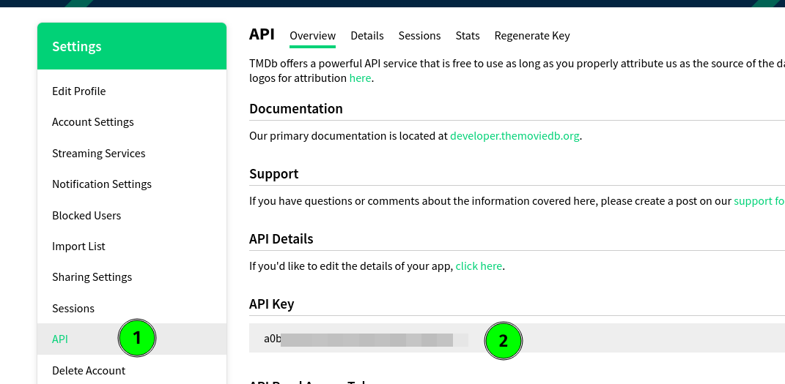
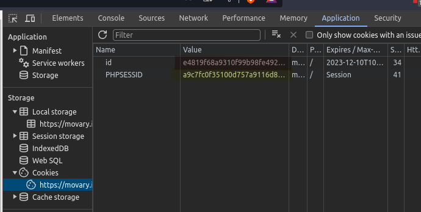
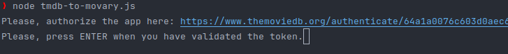
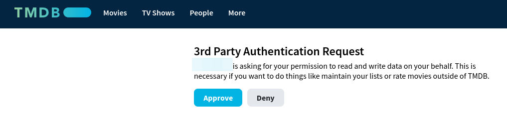

# The Movie DB to Movary

## Information

This is a personal project, that could be interesting for other people in the same situation as I was.

I discovered [Movary](https://github.com/leepeuker/movary), and wanted to start to use it to track the movies I watch.

Until now, I was using [The Movie Database](https://www.themoviedb.org/) to store this information, but as I want to keep 100% control of my data, I chose [Movary](https://github.com/leepeuker/movary).

So this is a small script to automatize the export of my ratings from [The Movie Database](https://www.themoviedb.org/) and import them into [Movary](https://github.com/leepeuker/movary).

## Requirements

- You need an api key from [The Movie Database](https://www.themoviedb.org/).
- You need an instance of [Movary](https://github.com/leepeuker/movary)

## Usage

You need to take some data and put it into the script. 

At the top of the script, you can find some strings with the text **FILL_WITH_YOUR_VALUE**, just replace it, with your own values.

- `tmdb_api_key`: here you need to take the api key from your profile in the movie database.

- `movary_url`: You need to enter the url for your Movary instance. For example `https://movary.mydomain.com`

The last two elements you need to fill are a bit more complex.

- `movary_cookie_value`: The value of the cookie named _**id**_ 
- `movary_php_session_cookie`: The value of the cookie named _**PHPSESSID**_

To get these values you need to login to your instance of Movary in your browser, open the _Developer Tools_ (F12 for example). 

After this, go to *Application*, and select _Cookies_ from your movary instance, there your should see a couple of cookies, copy the values,
in the picture you can see them on red and yellow, and paste them to the script.

## Run

To run the script, just be sure that you have node installed on your computer, at least Node 18.*

`npm install`

`node tmdb-to-movary.js`

While the script is running you get some information about the process of importing data from The Movie Database, and the results of the importation of the movies to Movary. 

### Accept The Movie Database Application

When you start the script, a message asking for authenticate you on The Movies Database website will be prompted.

Just click on the link, or copy/paste to your browser, login, and approve the request, and everything starts automatically.

## Other

> The list of movies from TMDB, will be stored on a file called **_movies.json_** in the project root, so you can check it after it, or commenting the part of the insertion to Movary, make a **dry-run**.

